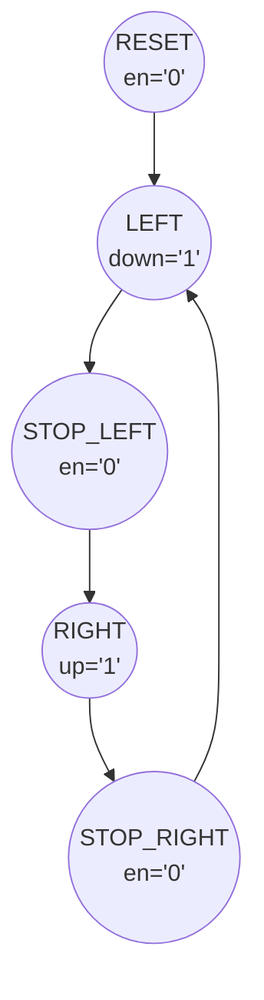

# NHK Semestrální práce
## Zadání:
> [!Info] 
> Na šestimístném sedmisegmentovém displeji se pomalu posouvá nápis „AHOJ“. Ovládá se jedním tlačítkem. Jeho opakovaným stiskem se začne nápis posouvat jedním směrem, dalším stiskem se posun zastaví, při dalším stisku se začne nápis posouvat na druhou stranu a dalším stiskem tlačítka se opět zastaví.

## TODO:
- [ ] Stavový automat
	- [ ] Ošetření vstupů
		- [ ] 2b posuvný registr
	- Výstup ovládá směr posunu
		- up/down/not_en
- [ ] Uložení textu
	- [x] ASCII -> 7-seg
	- [x] Paměť s konfigurací znaků
- [ ] Zobrazeni na výstup
	- [ ] Připojení 6x7-seg displejů
	- [ ] Pomalý časovač pro kroky posunu textu
	- [ ] Čítač indexu posunu
		- up/down
		- 0-5

## Postup
### Stavový automat
Seznam stavů a nastavení výstupů:
- `RESET`, 
	- en = '0' 
- `LEFT`,
	- down = '1'
- `STOP_LEFT`,
	- en = '0' 
- `RIGHT`,
	- up = '1'
- `STOP_RIGHT`.
	- en = '0' 


Mezi stavy se přechází při zmáčknutí tlačítka. 
### ASCII
V termínech standardu je typ `character` výčtový typ, který mapuje na ISO-8859-1 (tedy ASCII pro kódy 0-127).

Existují standardní předdefinované atributové funkce na výčtové typy, které mohou převádět mezi výčtovou hodnotou a její pozicí ve výčtu (`'pos()` a `'val()`), poté je převod znaku na jeho 8-bitové kódování dost jednoduchý:
```vhdl
subtype byte is std_ulogic_vector(7 downto 0);

function char_to_byte(c : character) return byte is
begin
	return byte(to_unsigned(character'pos(c), 8));
end function;

function byte_to_character(b: byte) return character is
begin
	return character'val(to_integer(unsigned(b)));
end function;
```

- [source](https://electronics.stackexchange.com/questions/626149/does-vhdl-2008-have-built-in-function-to-convert-std-logic-vector-to-character-t)

### Zobrazování
Přepočet indexu ve stringu na posunutý index na displeji, modulo počet displejů.

